# 🛍️ Shopcrawl

> **Smart Shopping Starts Here.**
> An AI-powered store comparison engine that aggregates real-time pricing from Amazon, Jumia, Kilimall, and Shopify to help users find the best deals instantly.
---
### 📸 Application Screenshots

#### 🏠 Home Page
| Desktop | Mobile |
|:---:|:---:|
| 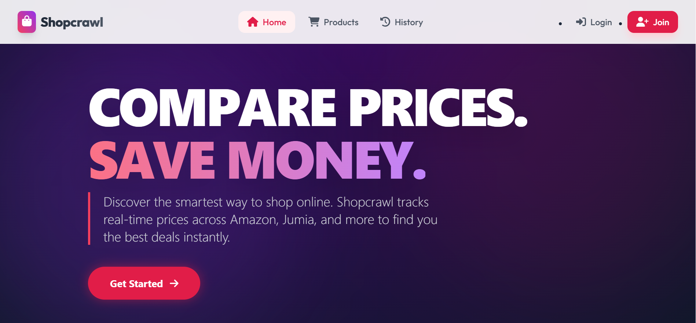 | 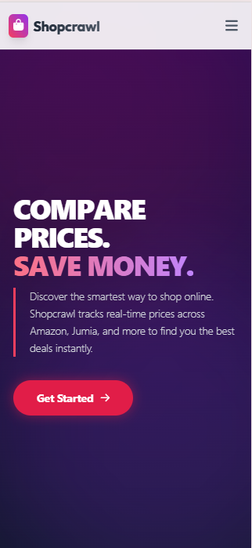 |

#### 🔐 Authentication
| Desktop Login | Mobile Login |
|:---:|:---:|
| 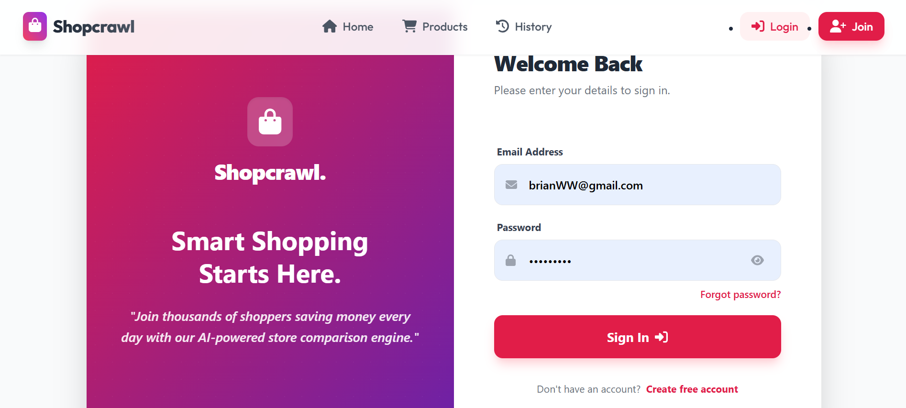 | 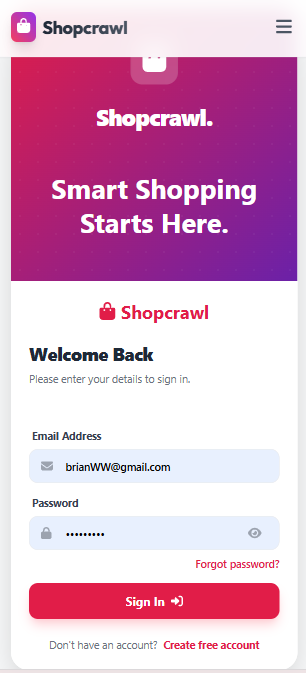 |

#### 🔍 Product Search
| Desktop Results | Mobile Results |
|:---:|:---:|
| 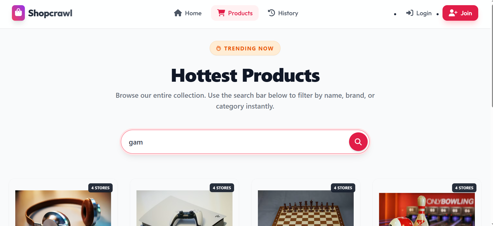 <br> 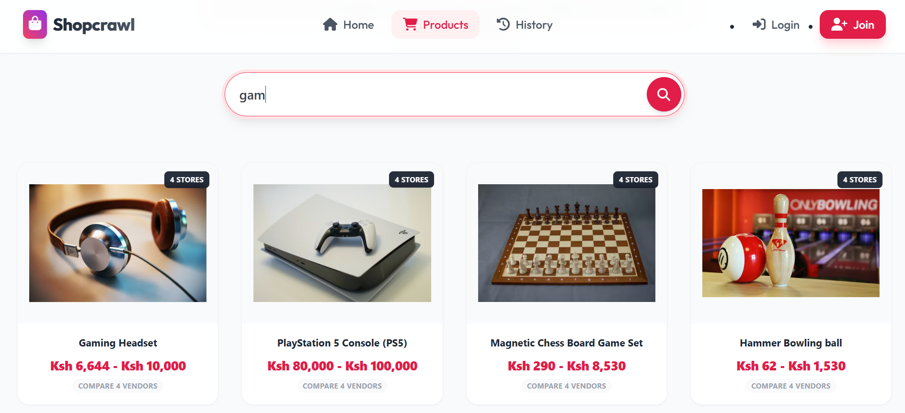 | 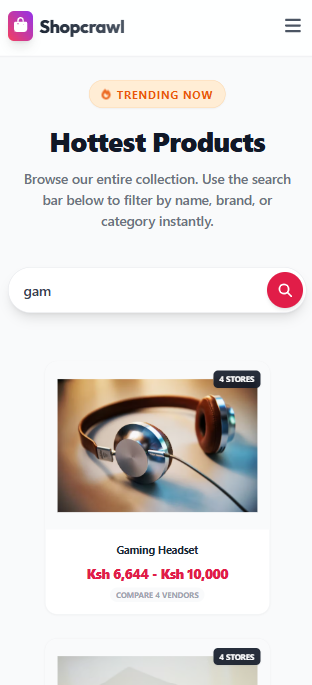 |

#### 🏆 SmartRank™ Analysis
| Desktop Comparison | Mobile View |
|:---:|:---:|
| 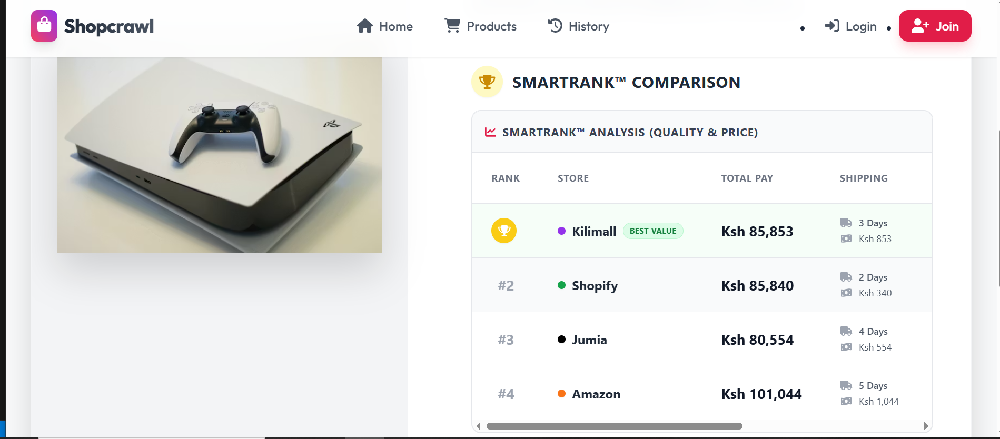 <br> <br> 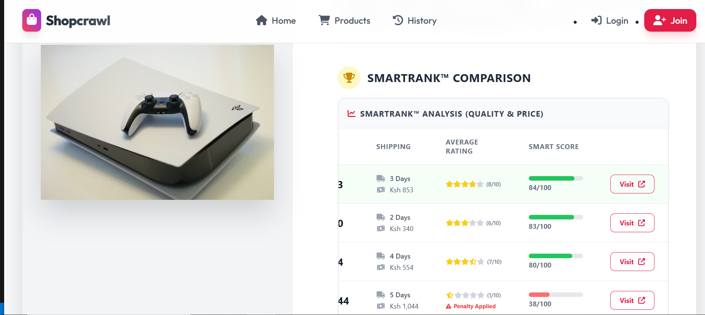 | 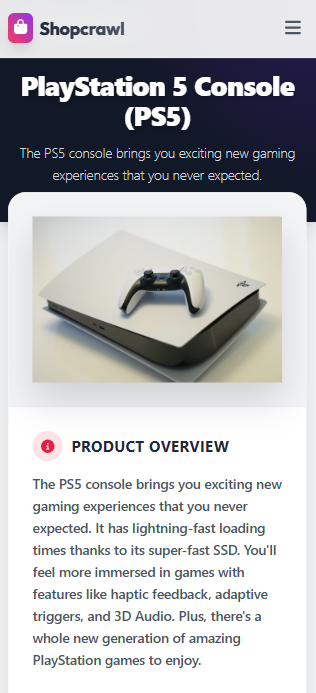 <br> <br> 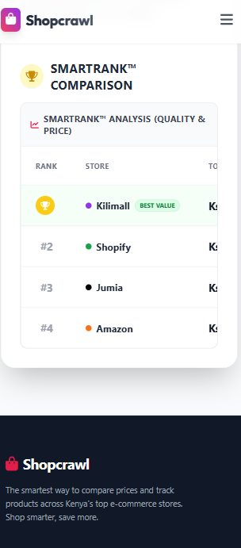 |
---


## 📋 Table of Contents
- [About](#-about)
- [Key Features](#-key-features)
- [Tech Stack](#-tech-stack)
- [Architecture](#-architecture)
- [Getting Started](#-getting-started)
- [Running Tests](#-running-tests)
- [API Documentation](#-api-documentation)
- [Author](#-author)

---

## 📖 About
**Shopcrawl** addresses the fragmentation of e-commerce in Kenya and beyond. Instead of opening four different tabs to check prices on Jumia, Kilimall, or Amazon, Shopcrawl provides a unified search engine. It features a secure authentication system, search history tracking, and a responsive, mobile-first design.

---

## 🚀 Key Features
* **🔍 Multi-Vendor Search:** Aggregates and compares products from Amazon, Jumia, Kilimall, and Shopify in a single view.
* **🔐 Secure Authentication:** Custom email-based login system with PBKDF2 password hashing and Token-based authentication.
* **🛡️ Admin Privileges:** Secret code registration system (`secret123`) to grant administrative access securely.
* **📜 Search History:** Tracks and displays the last 11 viewed items for signed-in users.
* **📱 Mobile-First UI:** Fully responsive design built with Tailwind CSS, ensuring a seamless experience on phones and desktops.
* **⚡ Real-Time Feedback:** Interactive UI with toast notifications for success/error states.

---

## 🛠 Tech Stack

### **Frontend**
* **React.js** (v18) - Component-based UI architecture.
* **Tailwind CSS** - Utility-first styling for rapid, responsive design.
* **React Router** - Single Page Application (SPA) navigation.
* **FontAwesome** - Vector icons.
* **Toastify** - User feedback notifications.

### **Backend**
* **Django REST Framework (DRF)** - Robust API development.
* **Django ORM** - Database abstraction and management.
* **Gunicorn** - Production-grade WSGI server.
* **SQLite** (Dev) / **PostgreSQL** (Prod) - Data persistence.

---

## 🏗 Architecture
The application follows a decoupled **Client-Server Architecture**:

1.  **Client (Frontend):** Handles user interactions, state management (Auth Context), and API consumption via `fetch`.
2.  **Server (Backend):** Exposes RESTful endpoints (`/api/products`, `/api/login`), handles business logic, and manages the database.
3.  **Security:** * Passwords are never stored in plain text.
    * API endpoints are protected via Permissions (`IsAuthenticated`, `AllowAny`).
    * CORS headers configured for secure cross-origin requests.

---

## 🏁 Getting Started

Follow these instructions to set up the project locally on your machine.

### Prerequisites
* Python 3.8+
* Node.js & npm
* Git

### 1. Backend Setup
```bash
# Clone the repository
git clone [https://github.com/JessyWaweru/SHOPCRAWL-BACKEND-PY.git](https://github.com/JessyWaweru/SHOPCRAWL-BACKEND-PY.git])
cd SHOPCRAWL-BACKEND-PY

# Create a virtual environment
python -m venv venv

# Activate virtual environment
# On Windows:
venv\Scripts\activate
# On Mac/Linux:
source venv/bin/activate

# Install dependencies
pip install -r requirements.txt

# Run database migrations
python manage.py migrate

# Start the Django server
python manage.py runserver
```

### 2. Frontend Setup
This project uses a separate repository for the frontend.

1.  Clone the frontend repository:
    ```bash
    git clone [https://github.com/JessyWaweru/SHOPCRAWL-FRONTEND.git](https://github.com/JessyWaweru/SHOPCRAWL-FRONTEND.git)
    cd SHOPCRAWL-FRONTEND
    ```

2.  Install dependencies and start:
    ```bash
    npm install
    npm start
    ```
## 🧪 Running Tests
This project maintains high code quality through automated integration tests covering Authentication (Signup/Login flow) and Product Search functionality.

To run the test suite:
```bash
cd backend
python manage.py test -v 2
```

## 📡 API Documentation

| Method | Endpoint | Description | Access |
| :--- | :--- | :--- | :--- |
| **POST** | `/api/users/` | Register a new user | 🌍 Public |
| **POST** | `/api/login/` | Login & receive Token | 🌍 Public |
| **GET** | `/api/products/?search=iphone` | Search for products | 🌍 Public |
| **GET** | `/api/history/` | Get user search history | 🔐 Authenticated |
| **POST** | `/api/history/` | Add item to history | 🔐 Authenticated |

## 👨‍💻 Author

**JESSY BRYAN WAWERU**
*Full Stack Developer*

* 📧 CONTACT
```
+254703261126
```

---
